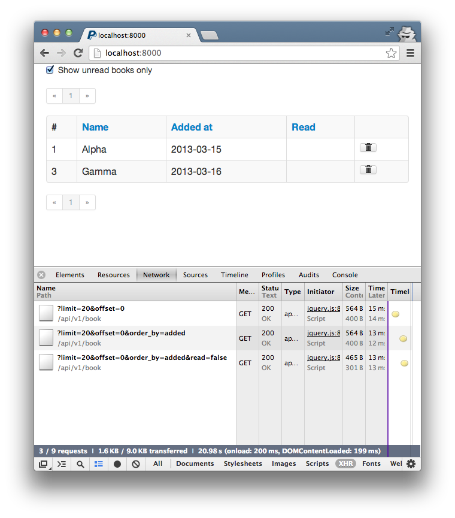

# TastyBackbonePie

Django helper classes to create ajax data tables with [backbone.js](http://backbonejs.org/) and [django-tastypie](http://tastypieapi.org/).
Includes a way to easily paginate, sort and filter tables too.

__Version 0.1 alpha - This project is in a very early stage.__



## Installation

### Requirements

Maybe it works with other versions too, but atm it is tested with:

- Django 1.5
- Tastypie 0.9.12

Install using pip:

```bash
pip install django==1.5 django-tastypie==0.9.12
```

### Install TastyBackbonePie

0. Using pip too:
	
	```bash
	pip install https://github.com/sspross/tastybackbonepie/zipball/master
	```

0. Add it to your `INSTALLED_APPS`:

	```python
	INSTALLED_APPS = (
		...
		'tastybackbonepie',
		...
	)
	```

## How to use

You can also take a look at the source of the test project.

### Tastypie example setup

0. Create a Tastypie API ressource in e.g. `api.py` like:

	```python
	from tastypie.resources import ModelResource
	from myapp.models import Book


	class BookResource(ModelResource):
	    class Meta:
	        queryset = Book.objects.all()
	        resource_name = 'book'
	        allowed_methods = ['get']
	        fields = ('id', 'name', 'added', 'read')
	```

0. Add API to your `urls.py` file:

	```python
	from tastypie.api import Api
	from myapp.api import BookResource


	v1_api = Api(api_name='v1')
	v1_api.register(BookResource())

	urlpatterns += patterns('',
	    (r'^api/', include(v1_api.urls)),
	)
	```

Now you should be able to access your ressource over your API like `/api/v1/book/?format=json`.

### Basic table

0. Use `TastyBackbonePieTableHelper` to define your table and add it to your views context:

	```python
	from django.views.generic import TemplateView
	from tastybackbonepie.helpers import TastyBackbonePieTableHelper


	class BookTable(TastyBackbonePieTableHelper):
		uid = 'book_table'
	    root_url = '/api/v1/book/'
	    fields = [
	        {
	            'key': 'id',
	            'label': '#',
	        },
	        {
	            'key': 'name',
	            'label': 'Name',
	        },
	        {
	            'key': 'added',
	            'label': 'Added at',
	        },
	        {
	            'key': 'read',
	            'label': 'Read',
	        },
	    ]


	class TestView(TemplateView):
	    template_name = 'test.html'

	    def get_context_data(self, **kwargs):
	        context = super(TestView, self).get_context_data(**kwargs)
	        context['book_table'] = BookTable()
	        return context
	```

0. Render HTML and Javascript parts in your template:

	```html
	<link href="//netdna.bootstrapcdn.com/twitter-bootstrap/2.3.1/css/bootstrap-combined.min.css" rel="stylesheet">

	{{ book_table.render_html }}

	<script type="text/javascript" src="http://code.jquery.com/jquery.js"></script>
	<script type="text/javascript" src="{{ STATIC_URL }}tastybackbonepie/javascript/underscore-min.js"></script>
	<script type="text/javascript" src="{{ STATIC_URL }}tastybackbonepie/javascript/backbone-min.js"></script>
	<script type="text/javascript" src="{{ STATIC_URL }}tastybackbonepie/javascript/backbone-tastypie.js"></script>
	<script type="text/javascript">
	    {{ book_table.render_js }}
	</script>
	```


### Template fields

Define `template` on a field. You can use underscore template syntax and the `entry` object to access your field values.

```python
class BookTable(TastyBackbonePieTableHelper):
	...
	fields = [
		...
	    {
	        'key': 'read',
	        'label': 'Read',
	        'template': '<% if (entry.get(\'read\') == true) { %>x<% } %>',
	    },
	    ...
	]
```

### Additional HTML fields

Add `additional_html_fields `to your `TastyBackbonePieTableHelper` class and add string values of html to it. 
You can use underscore template syntax and the `entry` object to access your field values.

```python
class BookTable(TastyBackbonePieTableHelper):
	...
	additional_html_fields = [
		'<a class="btn" role="button" href="#" data-id="<%= entry.get(\'id\') %>"><i class="icon-trash"></i></a>',
	]
	...
```

### Column sorting

Add order fields in your tastypie `ModelResource` and set `order_by` on your fields.

```python
class BookResource(ModelResource):
    class Meta:
        ...
        ordering = ('name', 'added', 'read')
```

```python
class BookTable(TastyBackbonePieTableHelper):
    ...
    fields = [
        ...
        {
            'key': 'name',
            'label': 'Name',
            'order_by': 'name',
        },
        {
            'key': 'added',
            'label': 'Added at',
            'order_by': 'added',
        },
        {
            'key': 'read',
            'label': 'Read',
            'template': '<% if (entry.get(\'read\') == true) { %>x<% } %>',
            'order_by': 'read',
        },
    ]

```

### Filtering

Add filters to your tastypie `ModelResource` and change filter parameters via javascript:

```python
class BookResource(ModelResource):
    class Meta:
    	...
        filtering = {
            'read': ['exact'],
        }
```

```html
<label class="checkbox">
  <input type="checkbox" id="filter-read"> Show unread books only
</label>
{{ book_table.render_html }}
...
<script type="text/javascript">
    {{ book_table.render_js }}

    $('#filter-read').click(function(event){
        if ($(this).is(':checked')) {
            $.extend({{ book_table.uid }}.parameters, {'read': 'false'});
        } else {
            delete {{ book_table.uid }}.parameters.read;
            delete {{ book_table.uid }}.entries.filters.read;
        }
        {{ book_table.uid }}.render();
    });
</script>
```